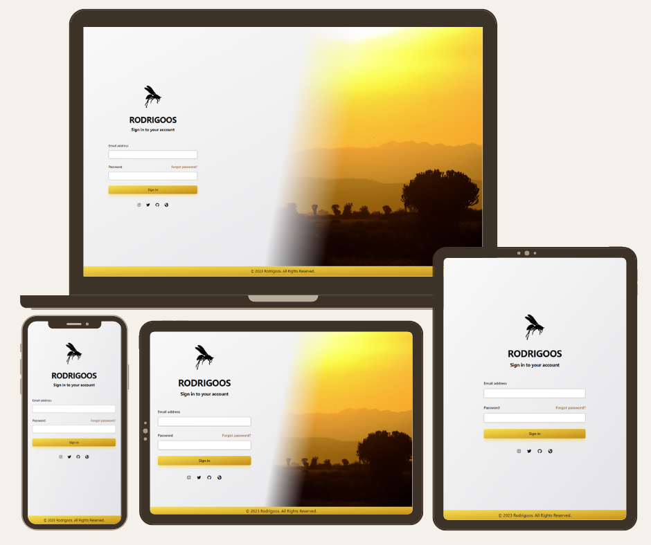
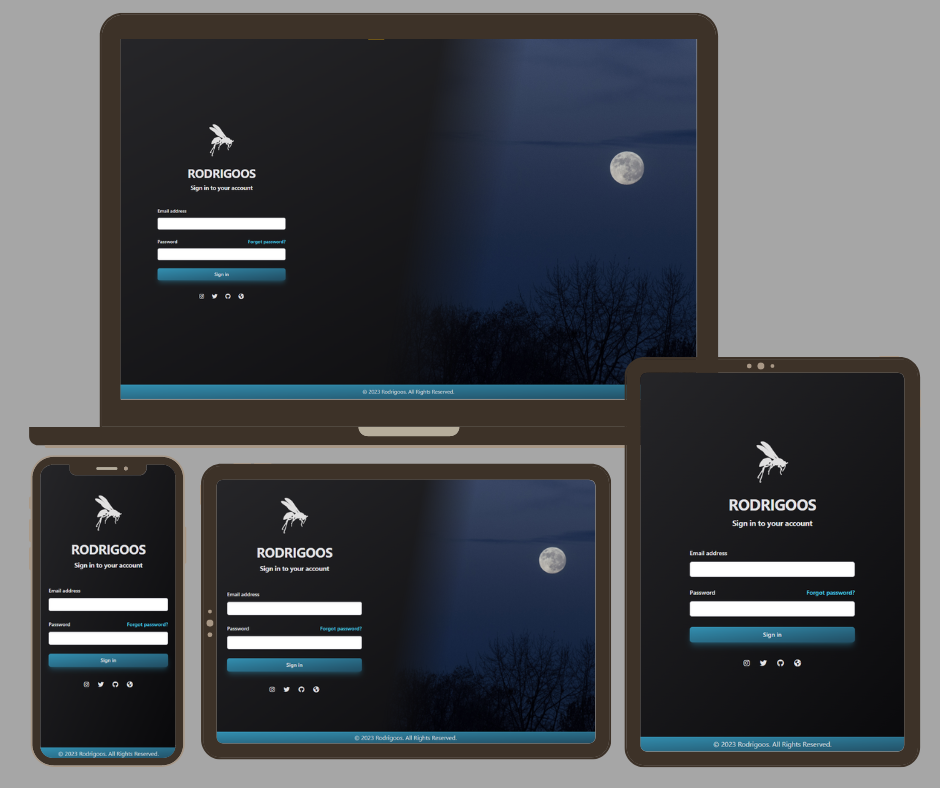

# login-screen-tailwind

https://rodrigoos.me/login-screen-tailwind

Fully responsive login screen for every screen existent, using tailwindcss.
Light and dark mode, sync with windows theme in the first theme, then the user can manually switch between them, using the button on the top left of the screen.

## Ligh Mode: 

## Dark Mode: 

